# Big Data & ML Pipeline — Oil Production Analytics

**Дисциплина:** Семинар наставника  
**Тема:** Big Data и ML  
**Преподаватель:** Владислав Шевченко

## Архитектура

```
PostgreSQL → ETL (Python) → MinIO (Parquet) → Jupyter → Superset
```

## Стек

| Сервис | Назначение | Порт |
|--------|-----------|------|
| PostgreSQL 15 | OLTP база данных | 5432 |
| MinIO | S3-совместимое хранилище | 9000 / 9001 (UI) |
| JupyterHub | Ноутбуки (pandas, sklearn) | 8888 |
| Apache Superset | BI-дашборды | 8088 |

## Структура проекта

```
project/
├── docker-compose.yml
├── sql/
│   └── 01_init.sql
├── etl/
│   └── extract_to_minio.py
└── notebooks/
    ├── 01_etl_pipeline.ipynb
    ├── 02_task1_production_analytics.ipynb
    ├── 03_task2_ml_prediction.ipynb
    ├── 04_task3_anomaly_detection.ipynb
    └── 05_task4_logistics.ipynb
```

## Быстрый старт

```bash
docker-compose up -d
```

| Сервис | URL | Логин | Пароль |
|--------|-----|-------|--------|
| Jupyter | http://localhost:8888 | — | — |
| MinIO Console | http://localhost:9001 | minioadmin | minioadmin123 |
| Superset | http://localhost:8088 | admin | admin |
| PostgreSQL | localhost:5432 | pipeline_user | pipeline_pass |

### Все контейнеры запущены
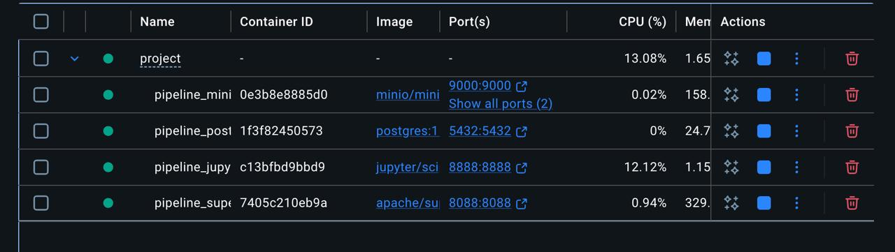

---

## Jupyter — список ноутбуков

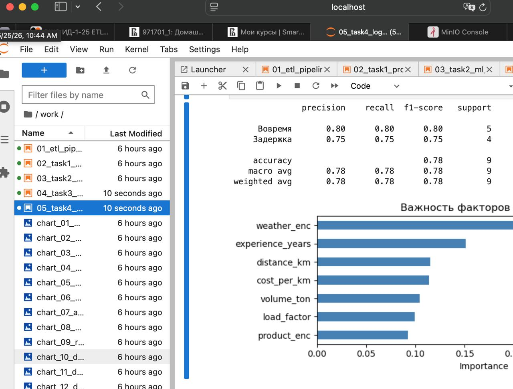

---

## MinIO — bucket с parquet файлами

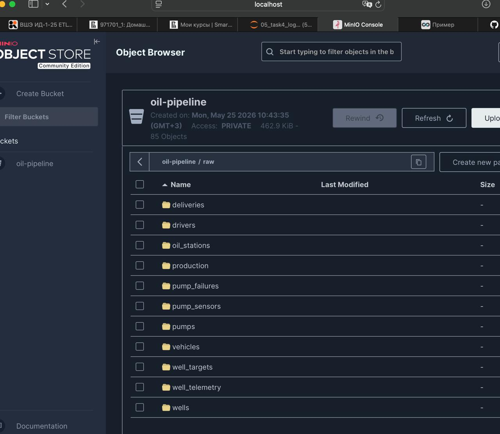

---

## Superset — дашборды

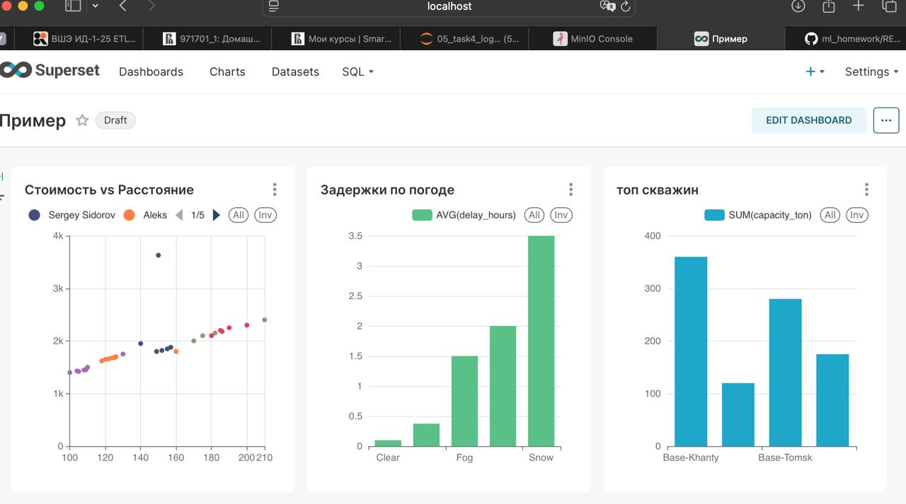

---

## Задание 1 — Аналитика добычи

### ETL ноутбук — результат выполнения


### Суточная добыча по скважинам (Line Chart)
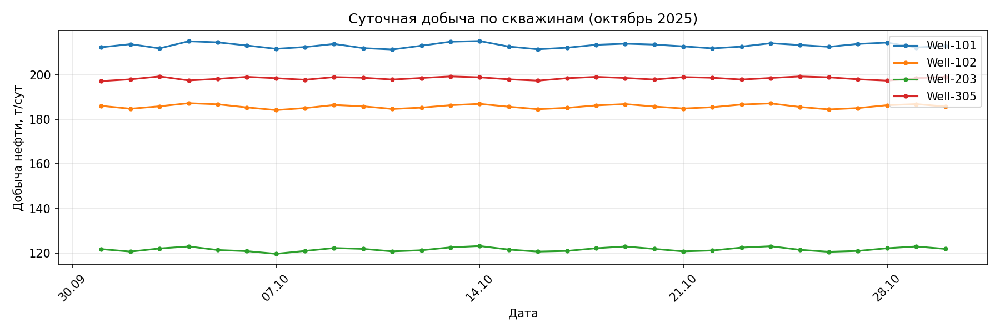

### KPI скважин: суммарная добыча и % простоя
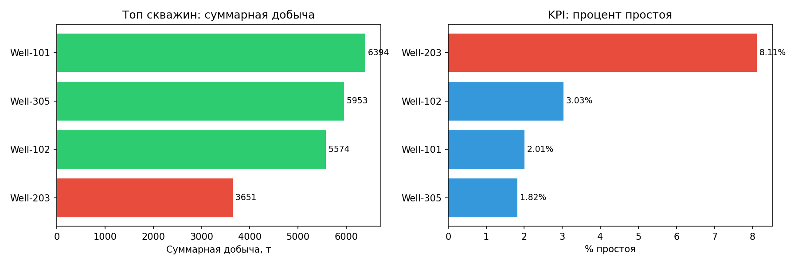

### Влияние давления и температуры на дебит (Heatmap)
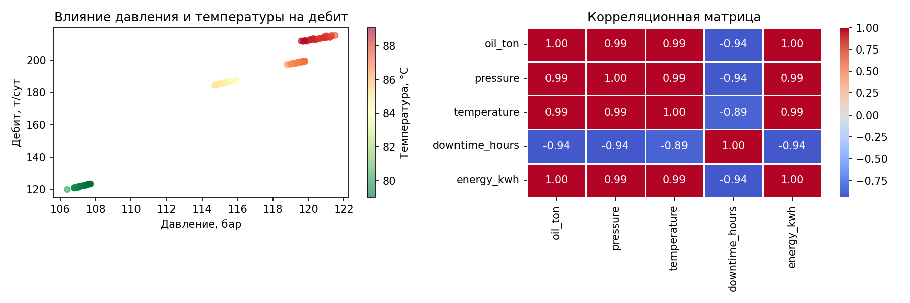

---

## Задание 2 — Прогноз дебита (ML)

### Метрики модели (MAE / RMSE / R²)


### Важность признаков — Random Forest
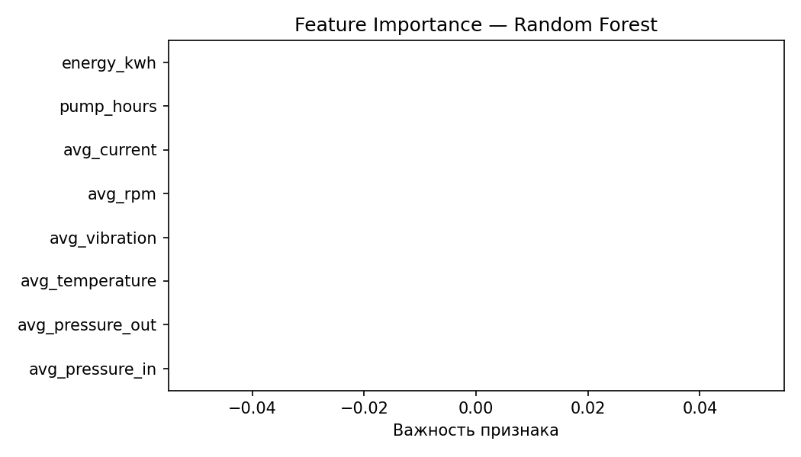

### Actual vs Predicted — Linear Regression & Random Forest
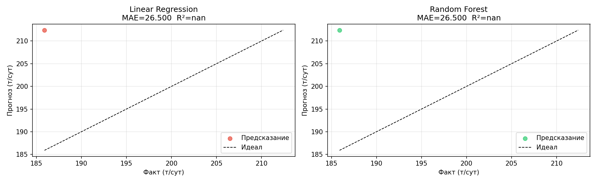

### Ошибка модели по времени
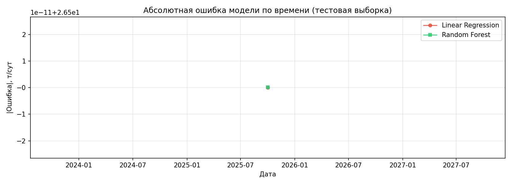

---

## Задание 3 — Аномалии и отказ оборудования

### Аномалии и Risk Score


### Аномалии по времени (температура, вибрация, ток)
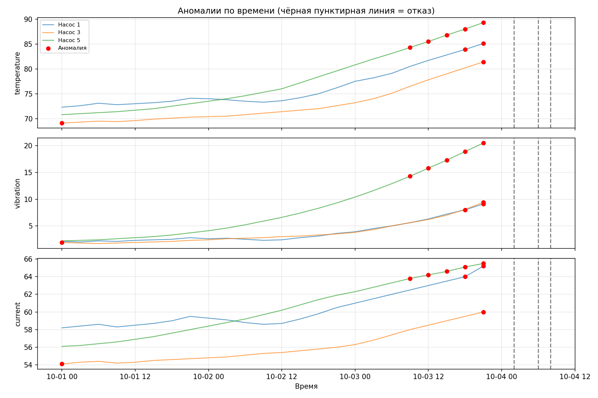

### Рост вибрации перед отказом насосов
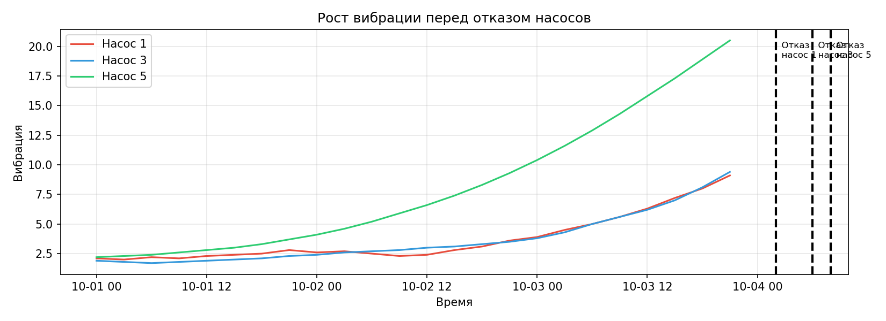

### Risk Score по насосам
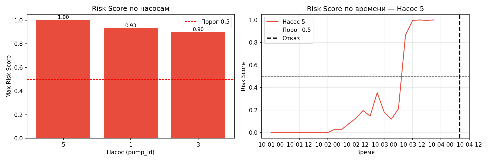

---

## Задание 4 — Логистика и поставки

### Задержки по погодным условиям & Cost vs Distance
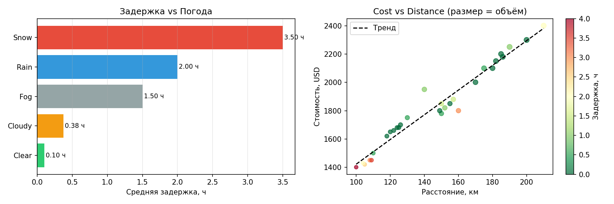

### KPI по водителям
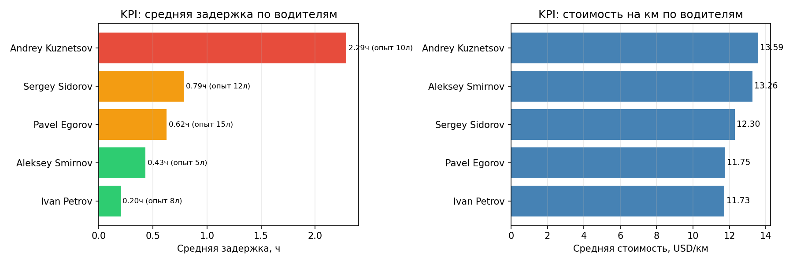

### Важность факторов задержки
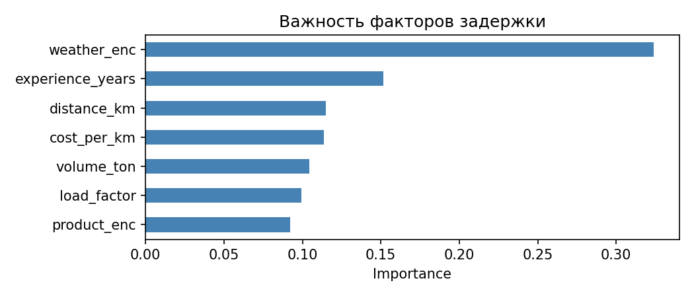

---

## Данные

| Таблица | Описание | Строк |
|---------|----------|-------|
| `wells` | Справочник скважин | 5 |
| `production` | Ежедневная добыча (окт 2025) | 150 |
| `well_telemetry` | Телеметрия по часам | 48 |
| `well_targets` | Целевой дебит для ML | 90 |
| `pumps` | Справочник насосов | 5 |
| `pump_sensors` | Данные датчиков | 72 |
| `pump_failures` | Факты отказов | 3 |
| `deliveries` | Поставки | 30 |
| `drivers` | Водители | 5 |
| `vehicles` | Транспорт | 5 |

## Витрины (Views)

| View | Описание |
|------|----------|
| `mart_production` | Добыча + данные скважин |
| `mart_failures` | Отказы + данные насосов |
| `mart_logistics` | Поставки + водители + транспорт |

## Чек-лист

- [x] docker-compose.yml — инфраструктура (PostgreSQL, MinIO, Jupyter, Superset)
- [x] sql/01_init.sql — схема и данные всех таблиц
- [x] etl/extract_to_minio.py — ETL скрипт
- [x] 01_etl_pipeline.ipynb — ETL с партиционированием Parquet
- [x] 02_task1_production_analytics.ipynb — аналитика добычи + витрина
- [x] 03_task2_ml_prediction.ipynb — Linear Regression + Random Forest (MAE/RMSE/R2)
- [x] 04_task3_anomaly_detection.ipynb — Z-score + Isolation Forest + Risk Score
- [x] 05_task4_logistics.ipynb — анализ задержек + KPI водителей
- [x] Superset дашборды — Delay vs Weather, Cost vs Distance, Driver KPI
